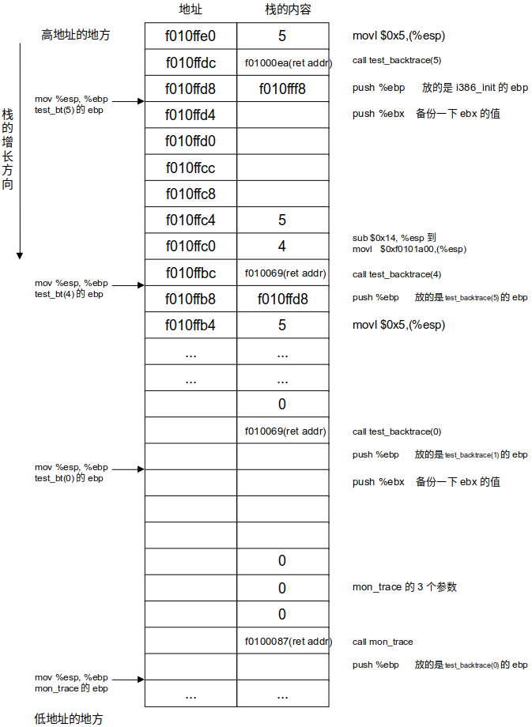
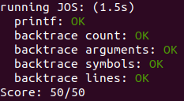

# lab1

### exercise 8. 实现8进制的格式输出。

在i386_init()中，有这么一行： 
```
cprintf("6828 decimal is %o octal!\n", 6828);  
```
它调用了cprintf()，并要求以8进制来输出数字6828  

查看/kern/printf.c中的cprintf函数:  
```
int
cprintf(const char *fmt, ...)
{ // 这个是比较靠近高级 的接口
	va_list ap;
	int cnt;

	va_start(ap, fmt); //相当于让指针 ap指向fmt的下一个参数，也就是参数列表
	cnt = vcprintf(fmt, ap); // 再把参数列表ap作为参数传递给vcprintf
	va_end(ap);

	return cnt;
}

```

它做的事情是获取参数列表(ap)后，调用vcprintf:
```
int
vcprintf(const char *fmt, va_list ap)
{
	int cnt = 0;

	vprintfmt((void*)putch, &cnt, fmt, ap);
	return cnt;
}
```

传递给vprintfmt的参数putch的内容：
```
static void
putch(int ch, int *cnt) //就是输出一个字符串而已
{
	cputchar(ch);
	*cnt++;
}
```

其中cputchar()函数是/kern/console.c中的函数，它的功能就是在屏幕上输出一个字符。


vprintfmt在/lib/printfmt.c中，思想是 依次判断字符串fmt(指定的格式) 中的字符，如果是普通字符，直接调用putch输出一个字符；如果是格式字符，那么用指定格式 输出ap中的对应参数。
```
void
vprintfmt(void (*putch)(int, void*), void *putdat, const char *fmt, va_list ap)
{
    ...
    // unsigned decimal
		case 'u':
			num = getuint(&ap, lflag);
			base = 10;
			goto number;

	// (unsigned) octal
		case 'o': //参考上面 case 'u'的写法即可
    		num = getuint(&ap, lflag);
    		base = 8;
    		goto number;
    ...
}
```
case 'o'就是我们需要编写代码的地方，参考上面的case 'u'即可。

输出结果为：6828 decimal is 15254 octal!


### exercise 10. 查看递归函数test_backtrace的栈结构。

同样的，在i386_init()中，有这么一行： 
```
test_backtrace(5);
```

在文件/obj/kern/kernel.asm中搜索 “test_backtrace(5)”，从这个位置开始打断点(0xf01000de)，逐行阅读汇编代码，观察栈的值的内容变化。

可以画出这样的栈的图：

 

观察可以发现这些规律：
1. 在调用函数前，会把所有要传递的参数都放在栈中(如果是x86_64位汇编的话，前5个参数是放在寄存器中的)。
2. 刚进入函数时，会push %ebx，也就是保存caller的ebx，然后callee再把ebx设为当前esp的值(mov %esp, %ebp)。


### exercise 11. 实现mon_backtrace()函数，打印ebp(当前callee的ebp)和eip(它的caller返回地址)，以及5个参数。

根据exercise 10中的规律，不难写出这些代码：
```
int
mon_backtrace(int argc, char **argv, struct Trapframe *tf)
{
	// Your code here.
	cprintf("Stack backtrace:\n");

	uint32_t ebp = read_ebp();//如果用指针的话，read_ebp返回的指针就刚好是当前ebp的位置
	//这样后面就不需要疯狂地使用汇编代码了。可以参考：https://github.com/shishujuan/mit6.828-2017/blob/master/docs/lab1-exercize.md
	uint32_t eip;
	uint32_t args[5];
	struct Eipdebuginfo info;

	while(ebp!=0){
		asm volatile("movl 0x4(%1),%0" : "=r" (eip) : "r"(ebp));

		asm volatile("movl 0x8(%1),%0" : "=r" (args[0]) : "r"(ebp));
		asm volatile("movl 0xc(%1),%0" : "=r" (args[1]) : "r"(ebp));
		asm volatile("movl 0x10(%1),%0" : "=r" (args[2]) : "r"(ebp));
		asm volatile("movl 0x14(%1),%0" : "=r" (args[3]) : "r"(ebp));
		asm volatile("movl 0x18(%1),%0" : "=r" (args[4]) : "r"(ebp));

		cprintf("  ebp %x  eip %x  args %08x %08x %08x %08x %08x\n",ebp,eip,args[0],args[1],args[2],args[3],args[4]);
		
		asm volatile("movl (%1),%0" : "=r" (ebp) : "r"(ebp));//上一个函数的ebp
	}

	return 0;
}
```

### exercise 12. 递归打印处各个caller的名字 以及 行数。

原理是使用了STAB的概念(symbol table)：http://sourceware.org/gdb/onlinedocs/stabs.html

在编译的时候，使用 -Wall -Wno-format -Wno-unused -Werror -gstabs -m32，就会生成stab table。

通过查看/inc/stab.h，可以知道，在xv6中，只有4种类型的symbol：N_SO(源文件名)、N_SOL(头文件名)、N_FUN(函数名)、N_SLINE(代码段的行号)

通过命令objdump -G obj/kern/kernel查看生成的stab table:
```
...
Symnum n_type n_othr n_desc n_value  n_strx String

-1     HdrSym 0      1229   0000190a 1     
0      SO     0      0      f0100000 1      {standard input}
1      SOL    0      0      f010000c 18     kern/entry.S
2      SLINE  0      46     f010000c 0      
3      SLINE  0      59     f0100015 0      
4      SLINE  0      60     f010001a 0      
5      SLINE  0      62     f010001d 0      
6      SLINE  0      63     f0100020 0      
7      SLINE  0      64     f0100025 0      
8      SLINE  0      72     f0100028 0      
9      SLINE  0      73     f010002d 0      
10     SLINE  0      79     f010002f 0      
11     SLINE  0      82     f0100034 0      
12     SLINE  0      87     f0100039 0      
13     SLINE  0      90     f010003e 0      
14     SO     0      2      f0100040 31     kern/entrypgdir.c
15     OPT    0      0      00000000 49     gcc2_compiled.

...
```

symnum是symbol table里面的索引，n_type表示symbol类型，n_desc是内容(对于SLINE来说就是行号)，n_value是地址。

symbol table的结构：
1. 在symbol table中，对于SO类型，它们是按照地址的递增的顺序来排序的，例如上面 symnum=0的SO，它的n_value是f0100000,下一个SO是symnum=14,n_value=f0100040>f0100000。

2. 在同一个SO中的FUN类型，它们也是按照地址的递增的顺序来排序的。
3. 在同一个FUN中的SLINE，它们也是按照地址的递增的顺序来排序的。


symbol table的结构示意：
SO_0  
---FUN_0  
    ---SLINE_0  
    ---SLINE_1  
    ---SLINE_2  
    ...  
---FUN_1  
    ---SLINE_0  
    ---SLINE_1  
    ---SLINE_2  
    ...  
...  

SO_1  
---FUN_0  
    ---SLINE_0  
    ---SLINE_1  
    ---SLINE_2  
    ...  
---FUN_1  
    ---SLINE_0  
    ---SLINE_1  
    ---SLINE_2  
    ...  
...  


那么如何根据esp来获取，函数所在的文件、函数名、行号呢？debuginfo_eip的的过程就解释了：

1. esp是一个地址，因为SO是递增的，那么用二分法(stab_binsearch)找到lfile和rfile。其中lfile.n_value(地址)<=esp && rfile.n_value（地址）>=esp
2. 同理，再根据lfile和rfile来找到，esp左右的func：lfun和rfunc。
3. 同理，再根据lfun和rfunc找到行号。

仿造第2点的内容，我们添加寻找行号的代码：
```// Search within [lline, rline] for the line number stab.
	// If found, set info->eip_line to the right line number.
	// If not found, return -1.
	//
	// Hint:
	//	There's a particular stabs type used for line numbers.
	//	Look at the STABS documentation and <inc/stab.h> to find
	//	which one.
	// Your code here.
	stab_binsearch(stabs, &lline, &rline, N_SLINE, addr);
	if(lline<=rline){
		info->eip_line = stabs[rline].n_desc;//对于N_SLINE, 它的desc存的是行号
	}else{
		return -1;
	}
```


lab1的内容都完成了，运行make grade：  
  


